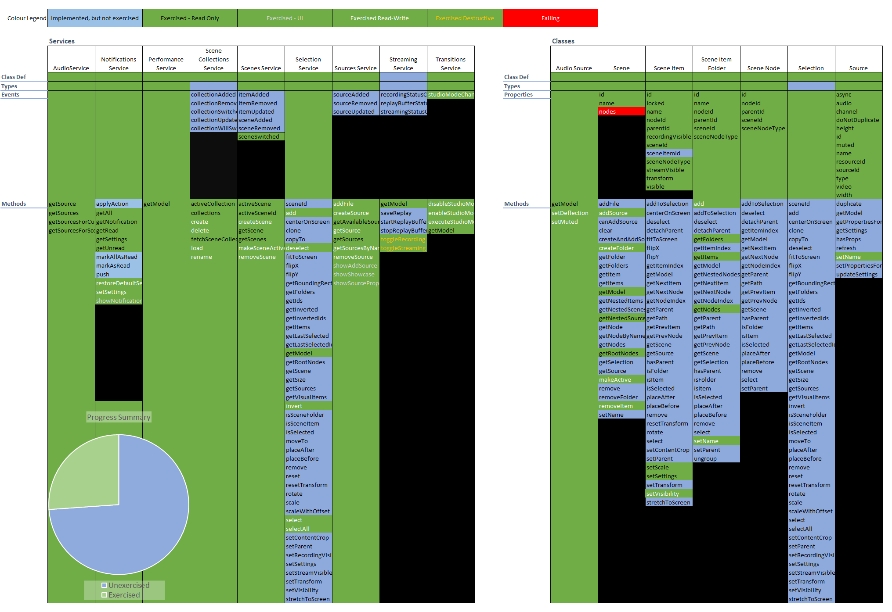

## Progress

This project is still in Alpha. This document explains what is ready to use
and what is not.

### Core Infrastructure

The ability to connect to the server, send commands, receive replies and 
subscribe to notifications is all in place.

All of the SlobsServices have been defined, and almost all of the Slobs
classes.

All of the Events and almost all of the Properties have been defined.

There are 170 commands that can be called on Classes and Services. At last 
count, only 70 had been implemented. (Note: Each method is relatively
short to implement; if there are particular commands you need implemented
faster, please raise an Issue.)

### Testing

It is difficult to write meaningful unit tests; the API is incompletely 
defined, and often depends unpredictably on the hardware set up, the
StreamLabs OBS configuration and no doubt the version.

It is necessary to run each server command and manually inspect the
result - this has been dubbed "exercising" rather than "testing" the commands
to emphasize its unsatisfactory nature.

The exercises are divided into four categories:

   * #### Read-Only Exercises
   
   These exercises are pretty safe to run, and generally just display the
   current configuration and usage of StreamLabs OBS.

   * #### UI-Affecting Exercises
   
   These exercises are pretty safe to run, but make temporary changes
   to the display: e.g. opening up dialog boxes or showing test notifications.
   
   * #### Read-Write Exercises
   
   These exercises make changes to the StreamLabs OBS configuration, but
   attempt to restore the settings back to how they were found.
   
   However, if they fail for any reason, it may leave your configuration
   changed. Use a test installation and/or make backups before running. 

   * #### Destructive Exercises
   
   These exercises make permanent changes, including **broadcasting a 
   new stream**.
   
   Ensure you are logged into a test account on your streaming host, or 
   your followers may get very confused when test data is streamed out.
   
 ### Progress Chart
 
 This unwieldy chart is colour-coded to show progress towards getting every
 Service, Class, Property, Event and Method available on the API both
 implemented and part of exercise code so they can be repeatable checked.
 
 